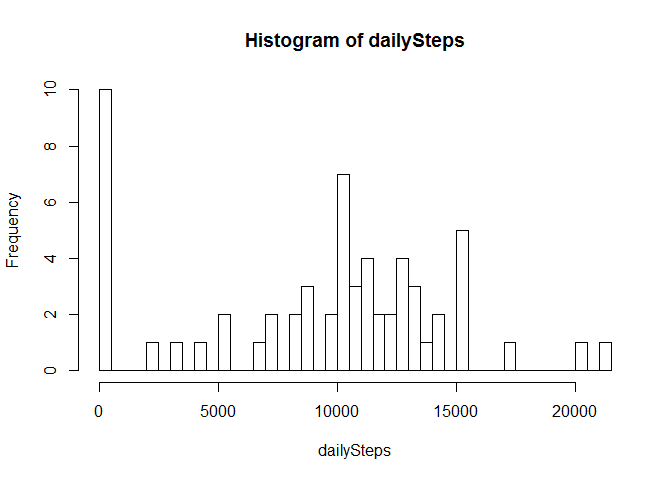
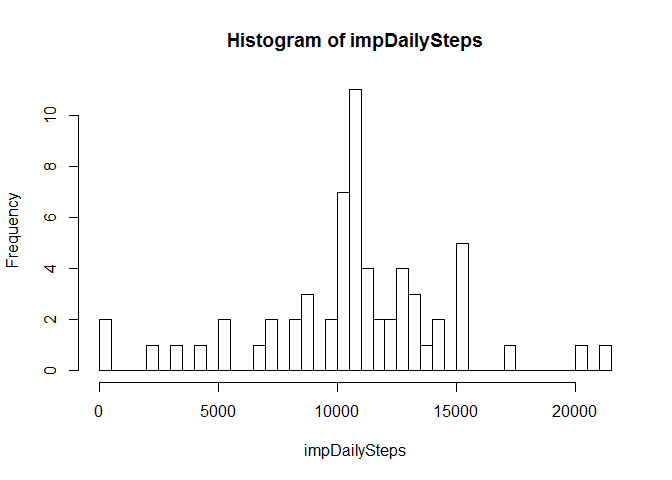
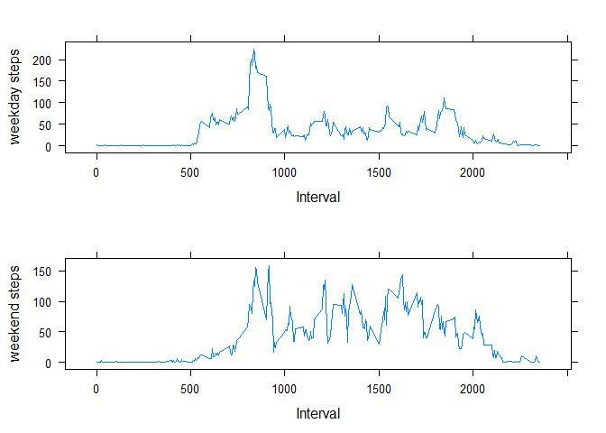

# Reproducible Research: Peer Assessment 1
*by Serdar Muslu*

For this assignment, we will be performing an exploratory analysis on "activity monitoring data" provided on the course web site, and also as part of the repository shared as part of the assignment.  The analysis is driven by the questions presented on the "Peer Assessment 1" readme document.


## 1. Loading and preprocessing the data
As mentioned above, the data is present in the working directory... in a zip file.  We will start by unzipping the data file and reading the file contents into a data-frame.  Since the "date" variable contents are in "char" form, it makes sense to convert them to "Date" values for easier time-series analysis.  Similarly, the "interval" variables are integers that identify 5-minute marks; however, we do not perform any conversions there for the purposes of this analysis as there are no queris regarding time intervals (the focus seems to be on daily sums and averages).


```r
unzip("activity.zip")
df <- read.csv("activity.csv")
df$date <- as.Date(as.character(df$date), "%Y-%m-%d")
```
***  
A quick peek into the data shows the following:

```r
str(df)
```

```
## 'data.frame':	17568 obs. of  3 variables:
##  $ steps   : int  NA NA NA NA NA NA NA NA NA NA ...
##  $ date    : Date, format: "2012-10-01" "2012-10-01" ...
##  $ interval: int  0 5 10 15 20 25 30 35 40 45 ...
```

```r
summary(df)
```

```
##      steps             date               interval     
##  Min.   :  0.00   Min.   :2012-10-01   Min.   :   0.0  
##  1st Qu.:  0.00   1st Qu.:2012-10-16   1st Qu.: 588.8  
##  Median :  0.00   Median :2012-10-31   Median :1177.5  
##  Mean   : 37.38   Mean   :2012-10-31   Mean   :1177.5  
##  3rd Qu.: 12.00   3rd Qu.:2012-11-15   3rd Qu.:1766.2  
##  Max.   :806.00   Max.   :2012-11-30   Max.   :2355.0  
##  NA's   :2304
```


## 2. What is mean total number of steps taken per day?  
Let's create an array of the total number of steps taken each day using the `tapply` function.  We will use this to view the relative frequencies of the total number of daily steps during the course of the 61-day data collection time frame.  We will do this by plotting a histogram.  
For this part, we will ignore the missing values in the dataset.  

```r
dailySteps <- with(df, tapply(steps, date, sum, na.rm=T))
hist(dailySteps, breaks=50)
```

 

The **mean** and the **median** for the total number of steps taken per day are:

```r
mean(dailySteps)
```

```
## [1] 9354.23
```

```r
median(dailySteps)
```

```
## [1] 10395
```


## 3. What is the average daily activity pattern?
Now, we will perform a similar analysis with some minor changes:  
* instead of dates, we will aggregate the steps in terms of time intervals,  
* instead of the sum, we will take the average (mean) of the number of steps for each interval,  
* instead of the array with the sums of 61 days, we will end up with an array with 288 (24 hours per day x 12 5-min intervals in each hour) averages,  
* instead of a histogram of daily-steps, we will make a time-series plot showing average interval activity thoughout the day.  


```r
intvlSteps <- with(df, tapply(steps, interval, mean, na.rm=T))
plot(intvlSteps, type="l")
```

 
  
Here, the points on the x-axis represent the indices for each 5-minute interval starting from *0 for 00:00* to *288 for 23:55 (or 11:55pm)*, while the y-axis represents the number of steps for that interval averaged across the full 61-day period that the dataset covers.
  
We see the maximum number of steps at about the 100-110th interval.  To be exact:

```r
maxStepsInterval <- which.max(intvlSteps)[[1]]
hr <- maxStepsInterval%/%12             ## each hour is 12 5-min intervals hence integer division
min  <- 5 * (maxStepsInterval%%12 - 1)  ## modulo remainder indicates the start of the interval
```
... it is the interval at **104**, or the 5-minute interval starting at **8:35**.


## 4. Imputing missing values
As shown on the first part of the assignment, there is a significant amount of NA's in the "steps" field.  The total number of the NA's again:

```r
sum(is.na(df))
```

```
## [1] 2304
```

One way of compensating for these NA values is using the average value for that 5-minute interval.  Note that, we have already created an array of averages in the previous section when we calculated the *intvlSteps*.  Let's use these values to fill in the NA's in the original dataset.  
We will create a new dataset, **impDF** to keep this clean.  We will first find the cases with the missing "steps" values, identify the 5-minute interval for that case, and fill in the "steps" value with the mean value from our previously-calculated *intvlSteps* array.


```r
impDF <- df                     ## create a dupe dataframe
x <- !complete.cases(impDF)     ## find the cases with NAs

## We need to find the proper intvlSteps array entry for the missing timeframe
## Each impDF$interval is an integer in the form HHmm.. let's map these to intvlSteps indices
##
## Hour component: hh <- impDF$interval[x] %/% 100
## The 5-min interval index: mmIdx <- impDF$interval[x] %% 100 / 5       
## The interval index: intvlIdx <- hh*12 + mmIdx
## ... e.g. interval labeled as 2145 will be intvlIdx 21*12+9 = 261

impDF$steps[x] <- intvlSteps[(12 * impDF$interval[x]%/%100) + (impDF$interval[x] %% 100 / 5)]
```

Let's make sure that the imputed data does not contain any NAs:

```r
sum(is.na(impDF))
```

```
## [1] 0
```

***
Great!  The next step is replicating the analysis in the second section of the assignment with the imputed data:

```r
impDailySteps <- with(impDF, tapply(steps, date, sum))
hist(impDailySteps, breaks=50)
```

 
  

And the new **mean** and the new **median** for the total number of steps taken per day are:

```r
mean(impDailySteps)
```

```
## [1] 10766.14
```

```r
median(impDailySteps)
```

```
## [1] 10765.45
```

With all the NA values compensated for, the *mean* is significantly higher and closer to the *median* indicating a more even distribution.  Note that there are still some days with 0-50 step entries.  These are not NA's but actual entries in this range and therefore are not compensated during our imputation step.


## 5. Are there differences in activity patterns between weekdays and weekends?
To answer this question, we will create a new variable, *daytype* in our **impDF** dataframe that identifies a weekday vs. weekend.


```r
weekday <- c("Monday", "Tuesday", "Wednesday", "Thursday", "Friday")

impDF$daytype[weekdays(impDF$date) %in% weekday] <- "weekday"
impDF$daytype[!(weekdays(impDF$date) %in% weekday)] <- "weekend"

## Check how the dates are split
table(impDF$daytype)
```

```
## 
## weekday weekend 
##   12960    4608
```

Now, let's split the data into weekday and weekend based on this variable, and repeat our analysis in Section 3.  This time, we will end up with two plots: one for the weekday subset and the other for the weekend.

```r
wd <- subset(impDF, daytype == "weekday")
we <- subset(impDF, daytype == "weekend")

wdSteps <- with(wd, tapply(steps, interval, mean))
weSteps <- with(we, tapply(steps, interval, mean))

library(lattice)
pxd <- xyplot(wdSteps ~ wd$interval, type="l", xlab="Interval", ylab="weekday steps")
pxe <- xyplot(weSteps ~ we$interval, type="l", xlab="Interval", ylab="weekend steps")
print(pxd, position=c(0, .5, 1, 1), more=TRUE)
print(pxe, position=c(0, 0, 1, .5))
```

 

Our subject seems to be more active on the weekends even though the activity starts a bit later in the day.
***
